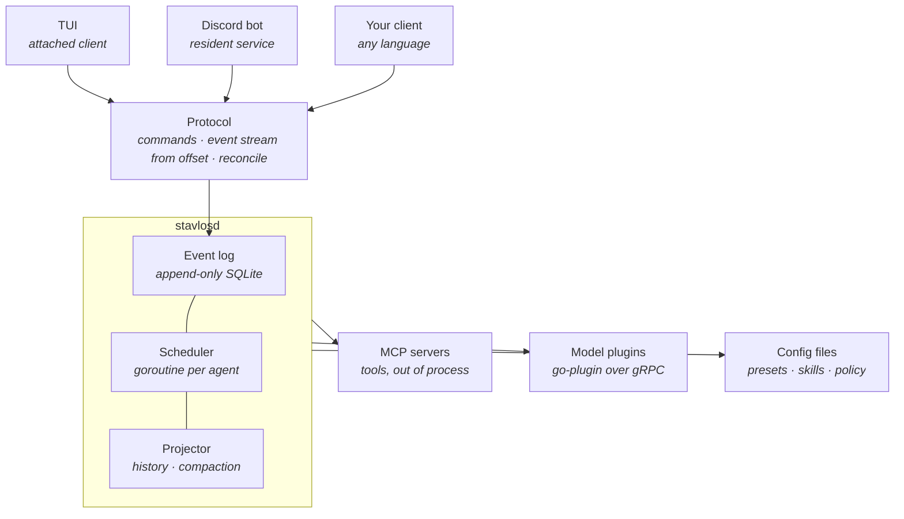
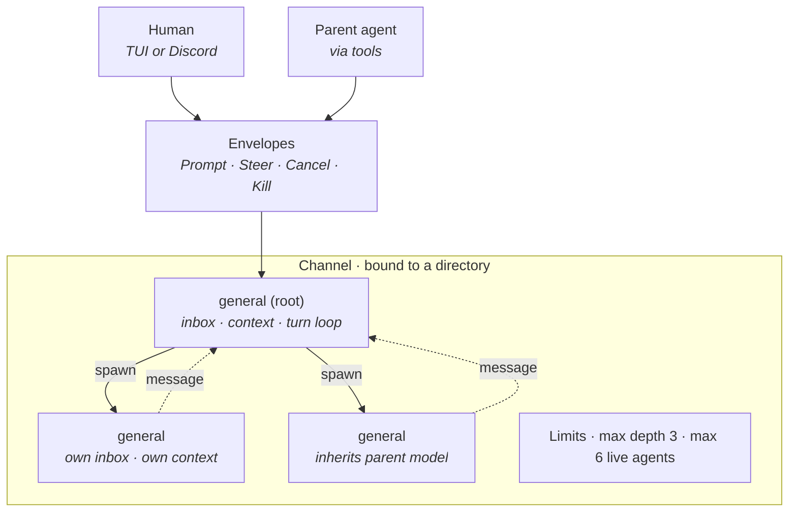
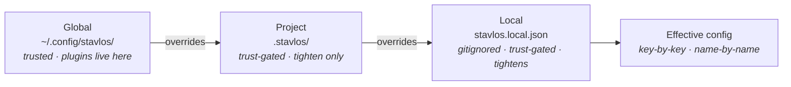
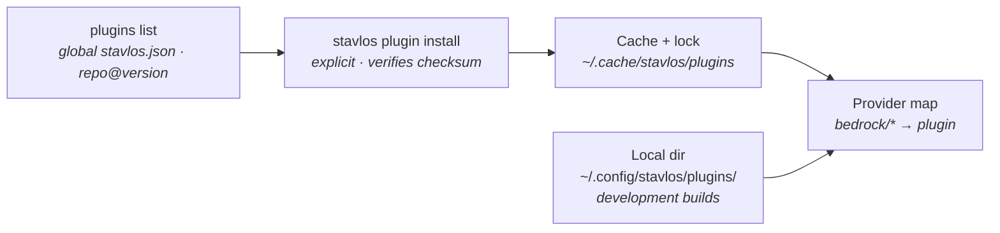

# Stavlos — Product Requirements Document

**Status:** Draft v0.4
**Scope:** v1
**Last updated:** 2026-09-12

---

## 1. Overview

Stavlos is an open-source agent harness written in Go. It runs a tree of AI coding agents on your machine and lets you drive them from a terminal UI, from Discord, or from any client that speaks its protocol.

The name is Greek for *stable* — the building where you keep workhorses. Stavlos houses a set of agents, dispatches them to work, and takes them back in when they're done.

The thesis in one sentence: **an agent is a long-lived actor you can talk to, not a function you call.** Every design decision below follows from taking that seriously — subagents that can be steered and cancelled mid-flight, frontends that are peers of one another, and a daemon that outlives all of them.

### Non-goals for v1

- Hosted or multi-tenant operation. Stavlos is local-first.
- IDE extensions.
- A web UI. The protocol permits one; we don't ship one.
- Sandboxing enforced by the daemon (see §12).
- Project-level plugins. Plugins are global (see §11).
- Autonomous unattended operation without an explicit permission policy.

---

## 2. Why this exists

**Delegation is fire-and-forget-and-wait.** Existing harnesses dispatch a subagent, block, and receive a blob of text. You cannot add an instruction to a running subagent without interrupting it, cannot cancel one turn without killing the channel, and cannot tell "the turn ended" apart from "the work is done."

**Remote access is a bolt-on.** Every Discord bridge in the wild wraps a CLI or REST client around a TUI-first product. The remote surface is permanently second-class: channels it can't see, prompts it can't answer, state it can't reconcile after a disconnect.

**The interesting seams aren't reachable.** Customization is usually a plugin API on top of a fixed core. The agent loop and the model adapter — the parts worth replacing — are welded in.

---

## 3. Design principles

1. **Subagents are first-class actors.** They can be prompted, steered, cancelled, and killed by the orchestrating agent or by a human, through the same inbox. They signal completion explicitly, with a typed payload.
2. **Frontends are peers.** The TUI and the Discord bot are both clients of the same daemon. Neither is privileged. Whatever the protocol can't express, no frontend can do.
3. **The log is the truth.** Every state change is an event. Everything a client or a model sees is a projection of the log. Resume, fork, replay, catch-up, and compaction are consequences of this, not features.
4. **Every capability is replaceable, on a schedule.** Model, loop, tools, storage, and frontends are all swappable. Defaults ship; nothing is welded in. But interfaces freeze only when they've earned it.
5. **A cloned repo cannot run code on your machine.** Project configuration is data. Anything executable is installed explicitly, globally, and verified.

---

## 4. Architecture

### 4.1 Process model



`stavlosd` is the only thing that owns state. Clients attach, subscribe, issue commands, and detach. The daemon survives every client. Everything below the daemon is either a subprocess it supervises or a file it reads.

### 4.2 The core (not replaceable)

Three contracts define Stavlos. Everything else plugs into them.

**Event log.** Append-only, SQLite-backed. Every state change is an event. Each event carries two numbers: a **per-channel sequence**, contiguous within its channel and the unit of offset subscription and fork, and a **global sequence** that totally orders events across channels. No *channel* state is stored outside the log that could disagree with it. Daemon-level state that is not channel state — trust decisions, the plugin lockfile, the Discord allowlist, Discord channel bindings — lives in the daemon's data directory.

**Scheduler / actor model.** One goroutine per live agent. Each agent owns a typed inbox and a `context.Context` derived from its parent's, so cancellation propagates down the tree for free.

**Protocol.** The wire contract between daemon and clients. This is the most consequential artifact in the project (§9).

### 4.3 Projection

The event log stores what happened. The **projector** turns it into what a model sees. Model-visible conversation history is never stored separately — it is computed from the log on demand and cached.

Two things the projector must handle, both of which are v1 requirements:

**Truncated turns.** A cancelled turn can leave a partial assistant message and a `tool_use` with no matching `tool_result`. Provider APIs reject that shape. The projector synthesizes a `tool_result` marking the call as cancelled (and, if the tool had produced partial output, including it). The model sees an honest account of what happened and can continue coherently.

A daemon crash or restart produces the same shape. On startup the daemon appends a `TurnAborted` event for every turn that was open when it stopped, and the projector repairs it exactly as a cancelled turn. Agents come back idle with their queued inboxes preserved. Nothing restarts automatically.

**Compaction.** Long-running agents exceed context windows. When the projected history approaches the model's limit, the daemon summarizes older turns via the model and truncates oversized tool outputs, then appends a `Compacted` event carrying the summary and the sequence range it replaces. The log is untouched; only the projection changes. Clients render the boundary. Compaction runs automatically before a model call when the projected history passes `compaction.threshold` of the model's context window (0.8 by default), summarising the older two thirds up to a turn boundary; `/compact` (`agent.compact`) summarises every completed turn of the selected agent at once — now when it is idle, or before its next model call when it is mid-turn (the reply says `compacted` or `queued`). `AgentInfo` carries `context` (the estimate the daemon measured at the last model call, or after a compaction) and `context_window`; the TUI shows them as `used% of window` on the meta row, warning-coloured from 70%. A compaction logs `compaction.started` (with the estimate going in) and then `compacted` (with `before` and `after` estimates) or `compaction.failed`; the TUI renders the compaction as one chat item — a rule with a sweeping bar between the two events, replaced in place by the `┄┄ compacted 84k → 12k tokens ┄┄` rule and the summary (or a "compaction failed" note; a turn that ends with the bar still up marks it interrupted). One compaction runs at a time per agent: a `/compact` that arrives while one is running, manual or automatic, is queued for the next model call rather than run alongside it, and a killed agent refuses it.

### 4.4 Accounting

Every model call appends a `Usage` event: input, output, and cached tokens, the model ID, and the cost computed from models.dev pricing. Usage is aggregated per agent and per channel, exposed by the `status` tool and the protocol, and rendered by frontends. Caps are post-v1 (§14); accounting is v1 because caps are meaningless without it and an orchestrator choosing models per task needs to see what its choices cost.

### 4.5 Replaceable seams

| Seam | Mechanism | v1 stability |
|---|---|---|
| Frontends | Protocol clients (any language) | Stable |
| Tools | MCP servers | Stable |
| Model adapters | `go-plugin` (gRPC) | Provisional |
| Agent loop | Go interface, `go-plugin` later | Unstable |
| Store | Go interface, `go-plugin` later | Unstable |
| Skills | `SKILL.md` files | Stable |
| Agent presets | YAML + markdown | Stable |
| Policy | Declarative config | Stable |

Staged stability is deliberate. Committing to six frozen interfaces in v1 produces a v1 we can't iterate on.

---

## 5. Channels

A **channel** is a root agent plus the subtree it spawns, bound to a working directory. Channels are the unit of independence: two channels bound to the same directory share nothing but the filesystem. Every channel has a name, unique across the daemon, shown as `#name`: the directory's base name by default (`#stavlos`, then `#stavlos-2`), changed with `/rename` (`channel.rename`, logged as `channel.renamed`). Starting the CLI in a directory opens its newest channel and creates one only when it has none; `stavlos new` starts another and `stavlos open <#name>` opens one by name.

Each channel owns:

- its own event history (a contiguous range in the log, keyed by channel ID)
- its own agent tree
- its own live-agent budget (§6.5)
- its own model selection, which children inherit by default (§8.3)

Channels survive client disconnects and daemon restarts (§4.3). They can be listed, resumed, forked from any per-channel sequence offset, and archived. Fork and archive are protocol operations; the TUI lists and resumes channels but does not fork or archive them yet.

---

## 6. Agents



Humans and orchestrating agents write the same envelope kinds into the same inboxes. Creating a child is asynchronous: `agent_create` returns immediately, and the child's answer, a `message` to its parent, wakes the parent. Two channels on the same directory would be two of these boxes side by side, each with its own budget and its own Discord channel.

### 6.1 The actor

Every agent — root or subagent — is a goroutine with a typed inbox:

```go
type Envelope interface{ isEnvelope() }

type Prompt        struct{ Text string }                 // queued; runs after the current turn
type Steer         struct{ Text string }                 // preempts at the next model-call boundary
type Cancel        struct{}                              // ends the current turn; agent survives
type Kill          struct{}                              // tears down the agent and its subtree
type Response struct{ From AgentID; Text string }        // an answer: a message from an agent this one waits on
type Reply         struct{ RequestID string; Answer any } // answer to a permission or question request
```

The orchestrating agent (via tools) and humans (via TUI or Discord) write to the same inbox. Nothing about "interactable by agent or user" needs special casing.

### 6.2 Turn semantics

A **turn** is one run of the agent loop: model call, tool calls, model call, … until the model stops calling tools. The four control envelopes differ in *when* they take effect:

| Envelope | Takes effect | In-flight tool call | Turn history |
|---|---|---|---|
| `Prompt` | After the current turn ends | Runs to completion | Intact |
| `Steer` | At the next model-call boundary | Runs to completion; output logged | Intact up to the boundary; steer text is injected before the next model call |
| `Cancel` | Immediately | Interrupted: the tool's context is cancelled; partial output logged | Truncated; projector synthesizes a cancelled `tool_result` |
| `Kill` | Immediately | Context cancelled | Agent and subtree torn down; log preserved |

Separating `Prompt` from `Steer` is the whole point. Other harnesses only offer the interrupting variant, so "also check X when you're done" derails work in flight. Steer is deliberately *not* a hard interrupt: a running `shell` command finishes and its output is recorded before the model is redirected. This keeps the log coherent and the semantics simple.

`Cancel` cancels the *turn's* context, not the agent's. Tool calls derive their context from the turn, so an in-flight command is interrupted. Children derive their context from the parent *agent*, not the parent's turn, so cancelling a parent's turn leaves its children running. The loop returns to waiting on its inbox.

Edge semantics, which protocol clients depend on:

- **Steer to an idle agent** behaves as a `Prompt`: it starts a turn and is logged as a prompt. Steer is "Prompt, but preempting if busy", and it is what the TUI sends for plain text.
- **Multiple queued `Prompt`s** are coalesced: when the turn ends, the inbox is drained and every queued prompt is delivered as a separate user message in one next turn.
- **`Cancel` with a pending permission or question prompt** withdraws it. The daemon emits a withdrawal event, every client removes the prompt, and a late `Reply` is rejected with an explanation (§7.4).
- **A `Response` to a busy agent** waits in the inbox and is delivered with the next turn's input.

### 6.3 Responses

Agents do not finish. A child is a persistent peer: its task is its first prompt, it answers with `message`, and it idles with its context intact until someone prompts it again or its creator kills it.

```go
message(to, text string) // to: an agent's name or id, or "user"
```

`message` to an agent that is waiting on the caller (it gave the caller a task, or messaged it) is the caller's answer. To any other agent it is a new message, delivered as a `Steer` (§6.2), and the caller now waits on that agent; to `user` it is logged on the caller as `agent.message_to_user` for the human. An answer is decided by the recipient's wait, not by the model, so the one tool cannot misroute: a question from a child whose parent waits on it arrives as that answer, and the parent's reply is a new message the parent then waits on. The answer is logged on the recipient (`agent.response`, so a daemon restart cannot lose an undelivered one), lands in the recipient's mailbox, and **wakes** it between turns: the first answer to arrive starts a new turn carrying every answer that has landed, so several answering together wake the asker once. Nothing is ever injected into a running turn; an answer that lands mid-turn waits for the boundary. Any agent can answer any agent in the channel, so a sibling's question gets a reply on the same terms as a parent's task. The caller stays alive after answering.

Because humans and agents can both message any agent, the runtime never guesses who a closing message is for: every reply goes through `message`, and the text a turn ends with is the agent's notes, which reach no one (the TUI shows them dimmed). That rule is in every agent's system prompt. Every prompt or steer an agent takes in, from the human or another agent, is owed a reply; answers, job results and reminders are not. A message to the party settles it and a kill drops it. Whenever a turn ends on its own (not cancelled, not failed) with replies still owed, and the agent is not waiting on an agent or a job, `agent.reminder_queued` is logged and a reminder turn starts naming everyone still owed. After three reminders in a row with no reply the agent is left alone; a reply or a new message resets the count. Nothing about what is owed is injected into the prompt: it is exposed as `AgentInfo.due` (the TUI's due tab). Recovery rebuilds the bookkeeping from the log. `"reminders": false` in `stavlos.json` turns reminders off.

**Waiting is a state of its own.** An agent that has ended its turn but has a question outstanding — a message not yet answered, a child's task — or a background job still running reports `waiting` rather than `idle` (§4.4): it expects to be woken. The expectation is recorded when the message or spawn is delivered, cleared by the answer or by the target's kill, and rebuilt on recovery from the logged spawns, agent steers and answers. Waiting agents cost nothing and do not count as busy.

**Children live as long as the channel.** The parent reads the answer when it is woken and messages the same child again if it needs more (the child keeps everything it learned). Nothing tears a child down: the fan-out limit counts busy agents only, an idle agent costs nothing per turn, and its MCP servers stop after ten idle minutes and restart at its next turn, so there is no cleanup for the model to remember or get wrong. An `agent_kill` tool existed for a while and went: models forgot it or called it too early and lost context the parent wanted a minute later. The daemon keeps a `Kill` verb for humans (and Discord); the TUI has no binding for it yet. This replaced an earlier `agent_finish`/`agent_result` pair, under which a child ended itself after one task and a follow-up meant a fresh agent rediscovering everything.

**Spawning is asynchronous, children never interrupt, and there is no blocking wait.** `agent_create` returns immediately with the child's ID and the child's first prompt is the task. A parent with nothing to do until a child answers ends its turn; the answer wakes it. A blocking wait was considered and rejected: it makes the parent deaf for the duration and buys nothing, since the history is intact when the answer arrives. Models were also unreliable with an explicit "wait" tool, calling it at odd moments.

**Limits count busy agents.** The fan-out limit (§6.5) counts agents that are working or have work queued; an idle child waiting for a follow-up costs nothing and does not block new spawns, which is why nothing needs to kill it.

### 6.4 Orchestration tools

Available to any agent whose preset permits them:

| Tool | Effect |
|---|---|
| `agent_create(archetype, label, task, model?)` | Create a child agent; returns its ID immediately; the task is its first prompt |
| `message(to, text, kind)` | `request` (the default): a `Steer` at the recipient's next step (mid-turn if busy, a new turn if idle); the recipient owes a reply and the caller waits on it. `response`: answers a request, delivered between turns, settling what the caller owed and the recipient's wait. `info`: a note nobody owes or waits on, delivered at the next step or with the next turn, never waking the recipient. To `user`: always a response, for the human |
| `agent_cancel(id)` | Deliver a `Cancel` to one of your children |
| `agent_status(id?)` | State and usage (§4.4) of one agent, or the whole channel tree |

There is no wait tool. A parent that has nothing to do until a child answers simply ends its turn; the child's answer wakes it. Models were unreliable with an explicit "wait" tool (calling it at odd moments), and the turn ending naturally is the same thing.

**Background jobs** use the same mailbox and wake. There is one command tool, `shell`: it runs the command and waits up to a window (`wait`, default 15 seconds, max 300); a command that exits in time returns inline, one still running continues as a job — the call returns the job id and the output so far, the process is adopted by the agent runtime (`AdoptCommand`) and killed only at the job timeout (`timeout`, default one hour, max two) — and `background: true` starts it as a job without waiting, for servers and watchers. When a job exits the agent is woken with the exit code and output, and `shell_kill(id)` stops it. Every agent with `shell` has `shell_kill`. The window is a trade between an idle wait (bounded by the window) and a wake-up round trip (a whole model turn); 15 seconds keeps builds, small test runs and installs inline. Nothing is armed by hand: a job's exit always wakes its owner, as an agent's response always wakes the agent it answers. Jobs are logged (`monitor.started`, `monitor.fired`, `monitor.stopped`); a job whose process died with the daemon is reported to its owner as lost on restart. File watches and timers were tried and removed: models rarely used them well, and a background `sleep` or `inotifywait` covers the need. In the TUI, the permission queue, what the selected agent is waiting on ("async": every agent whose answer it expects, exposed as `awaiting` on `AgentInfo`, then its running jobs; space on an agent row selects that agent) and the todo list ("todo") are permanent tabs on one strip in the footer (input, blank line, strip, meta row) — permission, questions (`ask_user` batches, answered one question at a time), async, due (who is waiting on the selected agent's reply), todo, mcp, dirs; the strip shows no directory, the dirs tab does, each showing only its count (down to "(0)"); the strip is one stop in the tab cycle that lands on permission, ←/→ move the highlight, and enter (or a click on a label) opens that tab's dialog, a centred box like every other dialog, which closes back to wherever it was opened from.

**Web access (§6.5).** Two daemon-side tools, so every agent behaves the same whatever its model and both go through the permission path. `web_fetch(url, start?)` fetches one page: http upgraded to https, credentials dropped, a GitHub `blob` URL rewritten to the raw file, the resolved address checked at dial time against the IANA special-purpose ranges (private, loopback, link-local, shared address space, benchmarking, multicast, documentation, NAT64, IPv4-mapped — `STAVLOS_WEB_ALLOW_LOCAL` lifts that for development), same-host https redirects followed, a redirect to another host or to plain http reported to the model instead, 10-second timeout, 5 MB read cap. The policy argument is the URL as it will be fetched (lower-case host, https, no credentials, fragment or default port, blob→raw applied), so a host rule cannot be dodged by spelling. Search backends go through the same address-checked client and may not redirect. HTML becomes markdown through a small readability pass (`<main>`/`<article>` when present; nav, header, footer, aside, scripts and styles dropped; headings, paragraphs, lists, links resolved against the page, code blocks, tables, image alt text kept); other text types come back as they are; binary is refused. The page is capped at 100k characters and returned 20k at a time (`start` continues), raw rather than summarised by a model — summarising is lossy and the agent can page. A 15-minute in-memory cache. The result is framed as untrusted content. Its policy argument is the URL, so `stavlos.json` allow-lists hosts by pattern (`"web_fetch": {"https://github.com/*": "allow"}`), roles tighten per pattern, and the permission dialog offers "Allow <host> for this channel" (`allow_prefix`; the prompt carries the host as its `prefix`). Default policy: ask. `web_search(query, n)` returns title, URL and a snippet per result for the agent to fetch from. With `search` configured in `stavlos.json` (`provider`: brave, tavily or exa; `apiKey`, `${env:NAME}` allowed) it calls that API; without it, it falls back to Exa's hosted MCP endpoint (`https://mcp.exa.ai/mcp`, a JSON-RPC `tools/call` of `web_search_exa`, answered as SSE), which needs no key — what OpenCode ships with — and reports itself as `exa-mcp (free, no key)` in the result so a rate limit surprises nobody. Default policy: ask until a `search` backend is configured (the fallback is a third party the user never chose; "allow for this channel" covers it after one answer), allow once one is, and an explicit `web_search` rule in `stavlos.json` wins either way. Provider-native search (Anthropic's and OpenAI's server-side tools) is a possible later opt-in; it would need the turn loop to handle server-tool blocks and only helps agents on that provider.

**MCP servers** are agent-level. A role's `mcp:` list names servers defined under `mcp` in `stavlos.json` (stdio: `command`, `args`, `env` with `${env:NAME}` references; `url` is parsed but not connected in v1). An agent starts its own process for each listed server at its first turn, over the official Go SDK (dual-era: the 2026-07-28 per-request protocol and the older `initialize` handshake), lists the tools once, and offers them to the model as `mcp__<server>__<tool>` (characters outside `[A-Za-z0-9_-]` become `_`, since the ChatGPT backend accepts nothing else) with the server's own descriptions. Calls go through policy like every tool (default ask; `mcp__github__*: allow` in `stavlos.json` or under a role's `tools`), through the same permission dialog, and are clipped like shell output. Nothing is shared between agents: a stateful server (a browser, a filesystem view) belongs to one agent, dies with it, and is stopped when a role change drops it from the list. Start-up, failure and stop are logged (`mcp.started` with the tool names, `mcp.failed`, `mcp.stopped`); a server that fails is skipped and the turn goes on without it; a server that exits is reported and started again at the next turn. Processes die with the daemon and are not restarted on recovery until the agent next runs. In the TUI, a fifth strip tab, `mcp (connected/listed)`, opens a dialog listing the selected agent's servers with their state, tool count and uptime; enter on a server shows its tools.

**Todo list.** An agent whose preset lists `todo` gets `todo_add(text)` and `todo_update(id, status?, text?)`: a per-agent plan with items in `pending`, `in_progress`, `done` or `cancelled`. Every change is logged as `todo.changed` with the whole list, so recovery replays the last one and every client shows the same list; the current list is projected into the system prompt at every model call, so there is no read tool and the plan survives compaction. The tool descriptions carry the rules the field has converged on: three or more steps, exactly one item in progress, done only when verified, a new item for a blocker. It exists for the human watching: the TUI's "todo" tab counts done over total, its dialog lists the items with status glyphs, and the turn indicator names the item in progress. Newer models plan well without it (Claude Code, Codex and Gemini have all turned theirs off by default), so it is a preset choice, on in `general`.

**The channel chat.** The TUI opens a channel on its chat (`docs/super-chat.md`): the human's posts and every agent's `message` to `user` (`agent.message_to_user`), in the order they happen, with a loader naming the agents a post still waits on; tool calls, permission prompts, questions and notices stay in the agents' own chats, where they are kept for auditing. A post goes through `channel.post`: the @names at its front pick the agents, the rest is delivered to each as a `Steer` from the human exactly as written (the root gets it when it starts with no name), a leading name that is no live agent refuses the whole post, and logs it once on the channel as `chat.posted` with the names it went to. Parents are not told when the human messages their child. Selecting an agent in the sidebar opens its own chat, where typing sends `agent.send` to that agent as before.

**Messaging and answering are channel-wide, lifecycle is parent-only.** Every agent has `message` and `agent_status`: a message may address any agent in the same channel by name — a child, a sibling, or the caller's parent — or the human, and the recipient sees who sent it (the sender's name as `from` on the logged message, `[message from agent …]` in the model's history). Names are unique in a channel and never reused, so a name in a message always means the same agent. A role can keep its agents from messaging the human with a deny rule on `message` for `user`. `agent_cancel` works only on the caller's own children: cancelling an agent someone else created would surprise its parent. "Same tree" means same channel; agents never reach across channels.

`label` is **required** on `agent_create`. It is the human-facing name in thread titles, pickers, and webhook identities. Optional labels produce unusable UI.

`model` is optional. When given, it overrides the child's preset default (§8.3). This lets an orchestrator make its own cost/capability decisions — "use a light model for the easy tasks, a heavy one for the hard tasks" — from instructions in `AGENTS.md` or its preset.

### 6.5 Limits

Two independent guards. Both are enforced primarily by removing `agent_create` from the tool list at the next model call, so the model is never invited to do something it can't. The tool list is fixed for the duration of a model call, so an `agent_create` that races the cap within a turn returns an error naming the limit; that is the fallback, not the mechanism.

- **Depth.** Configurable, default 3. Harnesses without this guard have produced documented cases of 18 levels of agents re-dispatching to each other with only the deepest doing real work.
- **Fan-out.** A per-channel cap on live agents, default 6. Every channel gets its own budget: six agents with two channels running means twelve live agents on the machine. There is no global cap in v1.

Depth alone does not bound cost. Fan-out alone does not bound recursion. Both are required.

---

## 7. Frontends

### 7.1 Two kinds of client

- **Attached clients** connect, render, and exit. Many may be attached at once. The TUI is one.
- **Resident services** are supervised by the daemon and outlive every channel they serve. The Discord bot is one.

Conflating these gets one of their lifecycles wrong.

### 7.2 TUI (Bubble Tea)

The TUI is the reference implementation of the protocol. Dogfooding it is the forcing function that keeps the protocol good enough for third parties.

Requirements:

- Channel list; create, resume, fork
- Agent tree navigation (parent / child / sibling)
- Live turn output with tool-call rendering, including cancelled calls and compaction boundaries
- A sidebar that is the swarm nav: channel directory, the channel's tokens and cost, the agent tree with cost per row, and an orange `!` (permission) or `?` (question) in place of an agent's or channel's dot while the human is waited on; the `!` and `?` tabs sit in the sidebar above the channels and `dirs` behind a gear (⚙) at the right edge of every channel row (→ on the row or a click on the gear opens that channel's dirs dialog), since the directories are the channel's; all three are back in the footer strip while the sidebar is hidden. The channel chat's footer carries only what is the channel's: no async · due · todo · mcp tabs, and the meta row is the mode tag with the channel's tokens and cost; an agent's chat has its role, model and variant on the meta row, with its async · due · todo · mcp tabs at that row's right end, and the permission and questions dialogs opened from them span every channel, while opening a channel or an agent that waits on the human opens its dialog on that channel's or agent's prompts only, `n` to jump to the next agent waiting on the human, and this directory's channels in alphabetical order, which never move on their own (the open one keeps its place with its agent tree under it; space opens another), and a `✚` at the right of the channels title (in the gears' column) that creates a channel in the directory under the name a popup asks for (refused when another channel has it); a channel reached from inside the TUI opens on its chat even while empty, the splash is only for a directory with no channel; the transcript shows the selected agent and the footer controls it — the permission and questions dialogs put the selected agent's prompt first and fall back to the oldest, the strip counts them all
- Direct addressing of any agent in the tree with any envelope kind
- Permission and question prompts
- Model and preset switching at any time: `/models` picks a model, `/roles` switches the selected agent's preset in place (system prompt, tools, spawn list change at its next turn; logged as `agent.role_changed` and replayed on restart); `/mode` sets the channel's permission mode (logged as `channel.mode_changed`, replayed on restart; old `channel.yolo_changed` events replay as yolo/ask): **ask**, the default, prompts for every policy ask and every call outside the channel's working directories; **auto** (`/auto`) allows policy asks inside the channel's directories and denies calls outside them (the set grows in the dirs tab, or from a boundary prompt in ask mode); **yolo** (`/yolo`) allows everything a policy would ask about, boundary included. Switching to auto or yolo approves the waiting prompts that mode would have allowed (auto skips boundary prompts). Explicit deny rules, model questions and the project-trust prompt are unaffected in every mode. Auto matches Codex's Auto preset and Claude Code's acceptEdits, with one honest difference: those are backed by a sandbox, this one by path inspection of commands (§10.7), so deny rules remain the floor. The TUI shows the mode tag at the start of the input, before its › (ASK dim, AUTO accent, YOLO orange), clickable back to ask; the mode is per channel rather than per agent (no guessing which subagents have it) and never daemon-wide (other channels are untouched); `/variants` picks a model variant — a provider-defined flavour such as reasoning effort (ChatGPT: low/medium/high/xhigh, Grok mini models: low/high) — per agent, logged as `agent.variant_changed`, inherited by a child that inherits its parent's model, and shown after the model on the meta row; `/providers` connects a provider (§8.4)

Implementation note: Bubble Tea's update loop is single-threaded. Daemon events arrive via `p.Send()` from a goroutine reading the event stream. Keep that boundary clean — TUIs that call business logic from `Update` become untestable.

### 7.3 Discord (post-v1)

Not in v1. The design below is kept so the protocol keeps serving it.

**Structure.** Guild = workspace. **Channel = channel.** Thread = subagent. The channel's root agent lives in the channel; each spawned subagent gets a thread. A channel is bound to a directory, so two channels can drive two independent channels on the same directory. `/channel new <dir>` creates a channel and binds it; `/channel attach <id>` binds a channel to an existing channel.

**Outbound identity.** Webhooks, which allow per-message username and avatar. Each agent posts under its own label.

**Inbound addressing.** Mentionable roles, one per *archetype* (`@coder`, `@explorer`, `@tester`). Roles need no members to be mentionable. Discord resolves them client-side and delivers `mention_roles` in the message payload, so there is no text parsing.

**Verbs.** A plain message is a `Steer`: it reaches a busy agent at its next model-call boundary and simply starts a turn when the agent is idle, which is what people mean when they type at a working agent. `/queue <text>` sends a `Prompt` instead (after the current turn), and esc twice on an empty input (the first press warns, the second within a few seconds confirms) sends a `Cancel`. Creating agents is left to the model (`agent_create`); humans steer, they do not micromanage the tree. Role mentions and thread context choose the *target*; the slash command chooses the *verb*. A slash command with no target in a channel addresses the root; in a thread it addresses that thread's agent.

**Scoping.** Roles are guild-scoped; there is no channel-scoped role. Resolution is therefore on the pair `(channelID, roleID)` — `@coder` in one channel and `@coder` in another reach different agents via the same role. Inside a subagent thread, a plain message with no mention targets that thread's agent; role mentions still work there for addressing siblings or the root. Disambiguation (below) is therefore only needed for mentions in the channel itself.

**Disambiguation.** When an archetype has multiple live instances in a channel, reply with an ephemeral select menu. Option label is the instance's task label; description is `under {parent archetype}: {parent label}` plus live status. Include an "all instances" broadcast option. The user's message text must survive the interaction round trip — store it server-side keyed by a nonce in the `custom_id`, with expiry.

**Constraints to design around:**

- ~250 roles per guild; role creation is rate-limited → archetype roles created once at `/setup`, never per-spawn
- 500 channels per guild, 1000 active threads per guild, and threads auto-archive after at most 7 days → a finished subagent's thread archiving is fine; a guild that runs many Stavlos channels needs its Discord channels cleaned up (see Archiving)
- String select max 25 options; description max 100 chars
- The bot's role must sit above roles it manages — check on startup and fail loudly
- Set `allowed_mentions` explicitly on every outbound message, or agent chatter will ping humans
- Message Content is a privileged intent; document it in setup

**Archiving.** Archiving a channel unbinds its channel and renames it with an `archived-` prefix. The channel and its history are kept; deleting it is the user's call. The event log remains the truth regardless.

**Access control.** Allowlist by user and role. The initial allowlist is configurable only via CLI, never from Discord, to prevent bootstrap attacks.

### 7.4 Escalation

Permission and question prompts need a routing policy, since several clients may be attached and none may be watching. Every client declares an **escalation tier** when it attaches: `interactive` or `fallback`. The TUI attaches as `interactive`; the Discord service attaches as `fallback`. Nothing in the daemon knows about Discord specifically.

1. The prompt is broadcast to all `interactive` clients. A client **claims** it when a human starts answering (focuses or opens the prompt), by sending an explicit claim; delivery alone never claims, so an unattended client cannot absorb prompts. The claimant is the only one that can answer. A claim with no `Reply` expires after a short timeout and the prompt is re-broadcast.
2. If unclaimed after *N* seconds, it is broadcast to `fallback` clients as well.
3. If unanswered after *M* seconds, the configured headless default applies (default: deny). This applies to permission prompts only: a question from an agent and the trust prompt have no sensible default and wait until they are answered or withdrawn. A trust decision made elsewhere (`stavlos trust`) settles an open trust prompt even if a client had claimed it.

*N* and *M* are single global settings in v1. Once a default has been applied, or the prompt has been withdrawn by a `Cancel` (§6.2), late answers are rejected with an explanation rather than silently ignored.

A subagent blocked forever on an approval nobody will see is the most common failure in this category of tool. The headless default must be explicit config, not emergent behavior.

---

## 8. Models

### 8.1 Approach

Other harnesses load provider adapters dynamically from npm. Go has no runtime module loader, so that doesn't port.

Instead: **consume the metadata, implement the protocols.** `models.dev/api.json` is a language-agnostic community database of model specs, pricing, capabilities, and auth env vars. Stavlos fetches and caches it for metadata; wire protocols are implemented natively.

### 8.2 Shipped adapters

Stavlos serves two providers, both through the user's own subscription rather than platform API keys:

| Provider | Sign-in | Wire protocol |
|---|---|---|
| `openai` (ChatGPT Plus/Pro) | Codex sign-in at `auth.openai.com`: browser (PKCE, callback on `localhost:1455`) by default, or headless device code (needs "Device code authorization for Codex" enabled in ChatGPT's Security settings) | OpenAI Responses API at the Codex backend (`chatgpt.com/backend-api/codex/responses`), bearer token plus account-id header |
| `xai` (SuperGrok) | Grok CLI device-code login at `auth.x.ai` (RFC 8628) | Chat Completions at `api.x.ai/v1` with a bearer token |

Both use the official CLIs' public client ids, the same arrangement opencode uses. The Chat Completions adapter behind Grok is generic enough for other compatible providers. `Model` is an interface; other providers are meant to arrive as `go-plugin` binaries (§11, post-v1).

### 8.3 Resolution

Model IDs are `provider/model-id`. When an agent starts, its model is resolved in this order, first match wins:

1. The `model` argument to `agent_create`, if the parent supplied one
2. The first entry of the role's `models` list, if set
3. The parent's active model (for the root agent: the channel's selected model)
4. Global config

Example: global config says `openai/gpt-5.4`; the user switches the channel to `openai/gpt-5.5`; the root creates a `tester` whose role lists `xai/grok-4`. The tester runs on `grok-4`. If the role listed no models, it would run on `gpt-5.5` — the parent's active model, not the global default. A child that inherits the global default while its parent is running something else is a real bug in existing harnesses; cover it in tests.

Resolution happens **once, when the agent is created**. Switching a channel's or a parent's model afterwards does not touch running children; to change a child's model, address the child directly with the model-switch command (§9). Live-linking would make a child's behaviour change under it mid-task with no event in its own history to explain why.

The `provider` prefix is looked up in the provider map (§11.4). An unknown prefix fails with an error naming the supported providers; plugins, which would add more, are post-v1.

### 8.4 Credentials

Credentials are subscription logins, stored in `<data dir>/auth.json` (mode 0600) as `{"openai": {"type": "oauth", "access": …, "refresh": …, "expires": …, "account_id": …, "email": …}}`. The TUI's `/providers` (and `stavlos auth login`) offers ChatGPT and Grok. ChatGPT then asks for a login method, as opencode does: **browser** (default; the daemon listens on `localhost:1455`, opens the authorize URL with PKCE, and exchanges the code when OpenAI redirects back) or **headless** (a URL plus a short code to enter on any device; polled). Grok has only the device-code method. Access tokens are refreshed on demand, single-flight per provider, and the rotated pair is persisted. `/models` lists what each subscription serves (for ChatGPT, the models the Codex backend accepts) at zero per-token cost, since the subscription is the billing unit; token counts are still recorded.

A channel always starts, model or no model: the TUI opens, and a turn with no model, or a signed-out provider, ends with an error naming `/models` and `/providers`. Spawning a child does require a resolvable model. The first model picked in a channel with none becomes the global default. `stavlos auth list` and `stavlos auth logout` round it out. Environment variables and API keys are not consulted.

---

## 9. Protocol

The most important artifact in the project.

**Transport.** Newline-delimited JSON-RPC 2.0 over a Unix domain socket (its location is below). The event stream is a subscription: the client sends one request naming a channel and a per-channel offset, and receives events as server-to-client notifications until it unsubscribes or disconnects. The choice is deliberate: any language can speak it, `nc` can debug it, and no code generation is required. TCP is a roadmap item for multi-machine operation; the daemon binds only the socket in v1. Every request carries a protocol version, and the daemon rejects versions it does not serve with the range it does. The socket lives under `$XDG_RUNTIME_DIR` when set (else the data directory), is created 0600 with the umask narrowed around the listen so it is never briefly open, and every connection is checked with `SO_PEERCRED` to come from the daemon's own user. The data directory carries an advisory lock (`stavlosd.lock`) for the daemon's life, so a second daemon on the same `events.db` fails at startup instead of stealing the socket. Each connection runs its requests under its own context (a client that disconnects takes its `login.wait` with it), may have 64 requests in flight, and may send lines up to 4 MB.

**Documentation.** The protocol specification is a v1 deliverable in its own right (§14): a message-by-message reference sufficient for a third party to write a client without reading the Go source.

It must carry:

- Channel list, create, resume, fork, archive; directory binding
- Agent tree with parent links, labels, archetypes, and live status
- All control envelopes (`Prompt`, `Steer`, `Cancel`, `Kill`), addressed to any agent by ID
- `agent.spawn`: a child created by a client, with role, label, task, and optional model
- Permission and question requests, claim, withdrawal, **and their replies**; the client's escalation tier at attach (§7.4)
- Trust prompts for project configuration (§10.6) and their replies
- Model and preset switching for a channel or agent
- Event stream subscribable **from a per-channel sequence offset**, not live-tail only
- Compaction events, so clients can render boundaries
- Usage events and per-agent / per-channel aggregates (§4.4)
- An authoritative state-reconciliation endpoint

The offset requirement is what lets a Discord bot that was offline for an hour catch up rather than showing a hole. Best-effort streaming without replay forces every client to reconcile by polling — a known failure in existing harnesses.

---

## 10. Configuration



Three layers with one layout. Global is yours and trusted. Project is the team's, committed, and untrusted until confirmed. Local is your per-project overrides, gitignored and trusted. Config keys merge key-by-key; presets and skills override name-by-name.

### 10.1 Layout

```
~/.config/stavlos/            # global; identical layout to .stavlos/ plus plugins
  stavlos.json
  roles/<name>.md
  skills/<name>/SKILL.md
  plugins/<name>/             # local plugin builds (§11)
  plugins.lock.json

<project>/
  .stavlos/
    stavlos.json              # committed
    stavlos.local.json        # gitignored
    roles/
      reviewer.md             # one role per file; filename = role name
      tester.md
    skills/
      go-conventions/
        SKILL.md              # required; anything else in the dir is bundled, not discovered
        reference.md
        scripts/lint.sh
  AGENTS.md                   # project instructions; stays at the repo root
```

### 10.2 `stavlos.json`

JSONC. A `$schema` key is accepted and ignored; no schema is published yet. Every key is optional; anything omitted falls through to the next layer, then to built-in defaults. `stavlos.local.json` has the identical schema. Loading is strict: an unknown key, a verb other than allow/ask/deny, a malformed duration, size, threshold or provider is an error that names the entry, never a silent default — a misspelt deny rule must not disarm itself. `stavlos.json` is written 0600 because it may hold a search key; `${env:NAME}` is preferred and a literal key draws a warning.

```jsonc
{

  "model": "openai/gpt-5.4",   // default for root channels here
  "rootAgent": "general",                 // preset a new channel's root uses

  "limits":     { "maxDepth": 3, "maxAgents": 6 },
  "escalation": { "claimTimeout": "30s", "answerTimeout": "3m", "default": "deny" },
  "compaction": { "threshold": 0.8, "maxToolOutput": "32kb" },
  "search": { "provider": "brave", "apiKey": "${env:BRAVE_API_KEY}" },   // web_search backend: brave | tavily | exa

  // MCP servers reachable by presets that list them. Trust-gated at project level.
  "mcp": {
    "github": {
      "command": "npx",
      "args": ["-y", "@modelcontextprotocol/server-github"],
      "env": { "GITHUB_TOKEN": "${env:GITHUB_TOKEN}" }   // references only, never literals
    },
    "docs": { "url": "https://mcp.example.com/sse" }
  },

  // Keyed by tool, then by argument pattern. Most specific match wins.
  "policy": {
    "shell": { "git push*": "ask", "rm -rf*": "deny", "*": "allow" },
    "apply_patch": { "src/**": "allow", "**": "ask" },   // every path a patch touches is checked; the strictest wins
    "read":  "allow",
    "agent_create": "allow",
    "skill": "allow",
    "mcp__github__*":     "ask",      // MCP tools are named mcp__<server>__<tool>
    "mcp__github__get_*": "allow"
  },

  // Global config only. Ignored with a warning if present at project level.
  "plugins": ["github.com/acme/stavlos-bedrock@v1.2.0"]
}
```

### 10.3 Roles — `roles/<name>.md`

A role (preset, archetype: the same thing in code and in the log) is one markdown file: YAML frontmatter, then the system prompt. The filename is the role name and becomes the Discord role. Global roles live in `<config>/roles/`, project roles in `.stavlos/roles/`; a project role with the same name wins. Every key but `description` is optional, and anything unset is inherited.

```markdown
---
description: Reviews a diff for correctness and risk; reports, never edits   # required
mode: subagent                  # primary | subagent | all (default)
models:                         # whitelist, in order; the first is the default; omit → any, inherit
  - id: openai/gpt-5.1-codex
    variants: [medium, high]    # allowed for this model; the first is its default
  - id: openai/gpt-5.1-codex-mini   # no variants → any the provider offers, provider default
  - xai/grok-4-fast             # shorthand for the same; globs such as openai/* are allowed
tools:                          # every tool is available; a bare deny removes one, rules tighten the rest
  shell:
    "git push*": deny
    "*": ask
  apply_patch: deny             # removed: never offered
  web_fetch: deny
skills: [review-checklist]      # skill descriptions this role carries
mcp: [github]                   # servers from stavlos.json it may reach
spawn: [explorer]               # roles it may create; omit or empty → cannot spawn
max_turns: 20                   # subagent only: turns before it must answer; 0 = unlimited
color: cyan                     # red blue green yellow purple orange pink cyan
---

You are a careful reviewer…
```

**Mode.** `primary` roles are offered in `/roles` for the main agent and are valid as the root role; `agent_create` refuses them. `subagent` roles are only created by `agent_create` from a role that lists them; `/roles` on the main agent hides them and a subagent cannot switch to a `primary` role. `all` is both, and the default; `general` is `all`.

**Models and variants.** The whitelist bounds `/models` and `agent.set_model` for any agent in the role. A child inherits its parent's model when the list allows it, otherwise it starts on the list's first plain entry; its variant is inherited only when that model's entry allows it, otherwise it takes the entry's first variant (or the provider default when the entry lists none). `/variants` and `agent.set_variant` are bounded the same way, and switching model or role re-fits the variant. All of it is enforced in the daemon, so a client cannot bypass it.

**Tools and rules.** Every role has every built-in tool (`shell`, `read`, `apply_patch`, `skill`, `todo`, `web_fetch`, `web_search`) unless `tools` removes it: a bare `deny` (`web_fetch: deny`) takes the tool away, so the model is never offered it. Adding a role therefore never means re-listing the tools it should keep. Any other verb, or a map of patterns under a tool, is a rule on a tool the role keeps (patterns are the same prefix globs as `stavlos.json`); rules on `todo` cover `todo_add` and `todo_update`. The list form of earlier versions is a load error, since it meant the opposite. Roles only tighten the layered policy (allow → ask → deny): the role's rules are one more overlay (§13), so a looser entry can never take effect; the plain cases of such an entry are reported as a configuration error at load rather than silently ignored. `message`, `agent_status` and `ask_user` cannot be removed, `shell_kill` comes with `shell`, and `agent_create`/`agent_cancel` with `spawn`; a rule on one of them only re-gates it.

**Working directories.** The channel has one working set, shared by every agent: the channel directory plus whatever the human adds. Roles carry no directories (a `dirs:` key is a load error) and `agent_create` grants none: one set is what a person can keep track of across many agents and repositories, the same reason the permission mode is per channel. A `read`, `apply_patch` or `shell` call that reaches outside the set asks first even when policy allows the tool: the prompt names the directory — the git checkout containing the path when there is one (one answer then covers a whole repository; a checkout rooted at the home directory does not count), else the path's own directory — "Allow once" allows, "Allow and add" allows and adds that directory to the channel, "Allow and add another directory…" takes an edited path (`dir` on `prompt.reply`) (logged as `channel.dir_added` on the asking agent, replayed on restart), `/yolo` answers it like any ask and auto mode denies it. For shell the paths are found by inspecting the command line — absolute and `~` arguments, `cd` and redirect targets, `--flag=path` values — which catches the model's ordinary behaviour and nothing adversarial; a kernel sandbox (bubblewrap, Seatbelt) is the roadmap item that would turn this list into a boundary, with the set as its writable roots. The TUI's `dirs n` tab, on the channel's row of the tab strip, lists the directories with their source (channel, human) and edits the set: `a` adds a path, enter replaces the highlighted one, ctrl+d removes it (`channel.add_dir` / `channel.remove_dir`, logged as `channel.dir_added` / `channel.dir_removed`; the channel directory cannot be changed); `ChannelInfo.dirs` carries the set. Logs from before the set was shared replay their `agent.dir_added` / `agent.dir_removed` events and `agent.spawned` grants into the channel's set.

**Permission answers.** Every permission dialog is the subject — the command or path, with the asking agent after it — over a hard-coded single-select list; there are no letter hotkeys. A plain permission: `Allow once` (`allow`), `Allow for this channel` (`allow_always`: this exact tool call, keyed on the policy argument), `Allow <prefix> for this channel` (`allow_prefix`; the daemon derives the prefix from the call when it raises the prompt and shows it as the prompt's `prefix`, so a client displays it rather than computing or sending one; offered for shell when the command is simple — `internal/shellcmd` tokenises it like a POSIX shell and refuses any unquoted `;`, `|`, `&`, newline, redirection, parentheses, backtick or `$(` — and the prefix is its first word, or two for git, go, npm, npx, cargo, make, docker, kubectl, pip, yarn, pnpm and bun when the second word is not a flag (a flag-first two-word tool, an environment assignment, and wrappers or interpreters such as `bash`, `env`, `sudo`, `xargs`, `python` get no prefix at all); the channel then approves every simple command of that tool whose first words are the prefix's, word for word), and `Deny` (`deny` with an optional `reason`). A boundary prompt: `Allow once`, `Allow and add <dir>` (`allow_always`, which also remembers the call), `Allow and add another directory…` (`allow_always` with `dir`), `Deny`. Trust: `Trust this project's config` or `Not now`, answered by prompt id like every other prompt (`trust.reply`, which the CLI uses, names a directory and the hash the client was shown; the daemon normalises the path and recomputes the hash from disk, and refuses a stale one). Remembered allows and prefixes live in the channel, not in config: each is logged as `permit.granted` and replayed on recovery, so a daemon restart does not ask again, and they end when the channel does. They answer a policy `ask` only: a `deny` rule holds whatever the human allowed earlier.

**Turn limit.** A subagent whose role sets `max_turns` is told, in its system prompt, which turn it is on and that it must answer before the limit. A turn past the limit ends at once with an error, and every agent still waiting on it receives an answer saying so, so nobody waits forever.

Only one role ships built in: `general`, a general-purpose engineer with shell, read, apply_patch, skill and todo that may spawn further `general` agents (the depth and agent-count limits bound the tree). Specialised roles — explorers, testers, reviewers — are the user's to add, one file each; the repository carries `.stavlos/roles/coder.md` as a worked example. The lifecycle tools (`agent_create`, `agent_cancel`) are implied by a non-empty `spawn` list; `message` and `agent_status` every agent has. Roles are the hub — skills, MCP servers and policy are referenced *by* roles, not parallel to them. Role creation must be as frictionless as skill creation, or users will reach for skills when a role is correct. Rejected: `hidden` (a spawnable but invisible role is a footgun; `mode` and spawn lists cover every case), `temperature` (variants cover what the providers here expose), `memory` and `hooks` (roadmap).

### 10.4 Skills — `skills/<name>/SKILL.md`

A skill is a directory containing a `SKILL.md` with frontmatter (`name`, `description`) plus a body, and optionally scripts, templates, and reference files alongside it. Discovery is "every directory under `skills/` containing a `SKILL.md`"; nothing else is scanned.

Descriptions stay in context; bodies load only when an agent calls the `skill` tool, which is gated by the `skill` permission. Skills are scoped **per archetype** via the preset's `skills:` list — otherwise every agent carries every description and progressive disclosure is defeated.

### 10.5 `AGENTS.md`

Plain markdown at the repo root, injected into every agent's context in that project. This is model-facing prose, not config: it is where "use light models for easy tasks" instructions live.

### 10.6 Trust

Project configuration is data, but a cloned repository's data can still cause code to run: `mcp` server definitions start processes, policy `allow` rules loosen what the model may execute, and presets, skills, and `AGENTS.md` are instructions the model will follow. On first load of a directory, the daemon prompts once for **all of it** — the whole `.stavlos/` directory plus `AGENTS.md` — showing what it contains, and records the decision keyed by directory plus a hash of those files' contents. A change to any of them re-prompts. Until confirmed, nothing from the project layer is loaded: no MCP servers start, no `allow` rules apply, no presets or skills are discovered, and `AGENTS.md` is not injected. The channel runs on global configuration alone, and the TUI and Discord both show that the project layer is pending trust.

A repository's files (`stavlos.json` and `stavlos.local.json` alike) can only **tighten** the global layer, never loosen it, even once trusted: both are in the trust hash, their policy is an overlay, and `env`, `search`, `plugins`, a raised limit and an `allow` escalation default are errors there (global only).

### 10.7 Deliberately not in `.stavlos/`

- Plugin binaries or plugin references — global only (§11)
- Credentials — subscription logins live in the daemon's data directory (§8.4); a search key in `stavlos.json` should be an `${env:NAME}` reference
- The Discord allowlist — global, CLI-only
- Channel state, logs, caches — the daemon's data directory, never the project

---

## 11. Plugins (post-v1)

Not in v1: providers are in-tree and `stavlos plugin` reports it is a roadmap item. The design below is kept for when plugins land.



### 11.1 What a plugin is

A `go-plugin` binary — subprocess plus gRPC, via `github.com/hashicorp/go-plugin`, not the Go stdlib `plugin` package. It requires no recompilation of the host, imposes no toolchain or dependency version matching, isolates crashes, and allows plugins in any language. gRPC overhead is negligible against LLM call latency.

Reserved for the deep seams: `Model` (v1), `Loop` and `Store` (post-v1). Everything else has a lighter mechanism — tools are MCP servers, observation is any protocol client subscribing to the event stream, and allow/ask/deny is policy.

### 11.2 Global only

Plugins are configured in `~/.config/stavlos/stavlos.json` and never in `.stavlos/`. A provider adapter is about *your* accounts and credentials, not the project's. A project says `"model": "bedrock/…"`; if no installed plugin serves `bedrock`, the daemon fails at channel start with the install command. This also means the trust question never arises for plugins: nothing in a cloned repository can cause a binary to run.

### 11.3 Sources and installation

Two sources:

- **References** in the global `plugins` array, Go-module style: `host/owner/repo@version`. `stavlos plugin install` resolves the release asset for the current OS/arch, verifies its checksum, unpacks it into `~/.cache/stavlos/plugins/`, and writes `plugins.lock.json`.
- **Local directories** under `~/.config/stavlos/plugins/<name>/`, for development builds.

Installation is explicit, not automatic at daemon startup. For binaries, "the daemon downloaded and ran something because a config line changed" is the wrong default. Startup loads what the lock resolves plus the local directory, and warns on anything unresolved.

Every plugin ships a manifest:

```json
{
  "name": "bedrock",
  "version": "1.2.0",
  "kind": "model",
  "apiVersion": 1,
  "providers": ["bedrock"],
  "binaries": { "darwin/arm64": "stavlos-bedrock", "linux/amd64": "stavlos-bedrock" }
}
```

`kind` and `apiVersion` gate the go-plugin handshake, so a plugin built against a future API fails loudly today.

### 11.4 Registration and load order

`providers` is how registration works: the daemon builds a map from provider prefix to plugin, and model IDs route through it. Two plugins claiming the same provider is a startup error, not last-wins.

Load order is the `plugins` array first, then the local directory. A local build therefore shadows a released one of the same name — the one place shadowing is what you want during development — and the daemon logs it.

---

## 12. Execution environment

**Child processes.** Every process an agent starts — a shell command, a background job, an MCP server — goes through `internal/proc`: `bash -c` in its own process group (a kill takes the children), a two-second wait for pipes after exit, the last 256 KB of output kept, and the daemon's environment scrubbed: `STAVLOS_*` and any variable whose name matches `API_KEY`, `APIKEY`, `SECRET`, `TOKEN`, `PASSWORD`, `PASSWD`, `CREDENTIAL` or `PRIVATE_KEY` are dropped, so a command the model runs cannot read them back into the transcript. `"env": {"pass": ["GITHUB_TOKEN"]}` in `stavlos.json` keeps named variables; an MCP definition's `env` adds what that server needs. The shell tool starts the process and hands it to the runtime when it outlives the wait window (or at once with `background: true`); the runtime owns kill, reap and report from then on.


Agents run commands directly against the channel's working directory. The daemon does not create worktrees or containers and does not enforce isolation.

This is a scope decision, not an oversight. Isolation strategies vary — git worktrees, containers, VMs, nothing — and the right one depends on the project. Stavlos leaves it to the user and the model: a preset or skill can instruct an agent to create a worktree before touching files, and policy can deny writes outside a given path. Daemon-enforced sandboxing is on the roadmap and will be designed so that policy remains unchanged when it lands; the policy schema is therefore safe to mark stable now.

---

## 13. Policy

Declarative config in v1: per-tool and per-pattern `allow | ask | deny`, evaluated against agent, tool, and arguments. Defined in `stavlos.json` (§10.2) and tightened per preset (§10.3). Project-level rules are subject to the trust gate (§10.6).

**Matching.** Every tool names its policy subject (`policy.Subject`): the strings a rule may match and their kind — a command line for `shell`, a path for `read`, every path a patch touches for `apply_patch` (the most restrictive decision wins), the URL as it will be fetched for `web_fetch`, an id for the agent and job tools, free text for the rest and the compact argument JSON for `mcp__*` (most MCP rules match on the tool name instead, as `mcp__github__*`). The kind is what the harness reasons about without naming the tool: a command may be compound, a path may leave the working set, a URL has a host to remember. Patterns compile once: `*` matches any run and `?` one character, everything else is literal (no pattern can fail to compile). For a path `*` and `?` stop at `/` and `**` crosses it; for commands, URLs and text `/` is ordinary, so `git push * --force` matches `origin/main`. A command line is judged whole and as each command inside it (assignments and launchers such as `sudo` or `timeout 5` dropped, `sh -c` scripts expanded), and the most restrictive decision wins. When several patterns match, the one with the **longest literal prefix** before its first wildcard wins; ties fall to the more restrictive verb (`deny` > `ask` > `allow`). The defaults and the global layer merge into one base set (a later rule with the same tool and pattern replaces the earlier one); the trusted repository files and the role's rules are overlays, and the decision is the most restrictive of the base's and of every overlay that has a matching rule (`policy.Layered`). An overlay therefore cannot loosen anything whatever its patterns are, not merely by inspection of them. A `shell` allow rule speaks for one simple command only: when the command line chains, pipes, redirects or substitutes (§10.3's simple-command test), an `allow` verdict becomes `ask`, so `cat *` never approves `cat x; rm -rf ~`. This is string matching, not a sandbox: `rm -rf*` does not match `rm -r -f`. It is a guard against the model's ordinary behaviour, not an adversary's, and the doc says so wherever policy is described to users.

A scripted policy (Starlark) is **deliberately post-v1**. Most users want "deny edits outside the project, ask before pushing," which declarative config handles. Shipping a language means shipping its docs, error reporting, and debugging story. The internal policy interface will be shaped so a scripted implementation can slot in later.

There is also no hook for *rewriting* a tool call before it executes (escaping a shell argument, injecting an environment variable). Policy can block; nothing can modify. That capability belongs in a custom loop rather than a new seam — see open question 2.

---

## 14. v1 scope

**In:**

- The daemon (`stavlos daemon`) with event log, scheduler, agent tree, projector (cancelled-turn repair, compaction)
- Protocol (server + Go client) and the protocol specification document
- Bubble Tea TUI
- Codex (ChatGPT) and Grok adapters, models.dev metadata
- MCP client
- Three-layer configuration with trust gate; skills, presets, declarative policy
- Built-in tools: `grep` and `glob` (read-only search over contents and file paths, judged by path like `read` and allowed by default; they run ripgrep with an argument list they build, or walk the tree), `shell` (the one command tool; no command is allowed by default, since "read-only" commands such as `find -exec` or `rg --pre` run programs; a command outliving the wait window continues as a background job, and every command runs in the sandbox) and `shell_kill`, `web_fetch` and `web_search` (§6.5), `todo_add` and `todo_update` (a per-agent plan, for presets that list `todo`), `read`, `apply_patch` (the Codex patch grammar: add, update with context-anchored hunks, delete, move; several files per patch, applied atomically), `skill`, the conversation set every agent has (`message`, `agent_status`), `ask_user` (one to four questions to the human, each its text and one to four options; every question is a checklist — the human may pick several and always has a last row for typing something else — so the model never adds an "Other"; one blocking prompt of kind `question` per call that never falls to the headless default and that no permission mode answers; the answers return as "question → answer" lines, picks joined with ", "), and the lifecycle set for presets that spawn (`agent_create`, `agent_cancel`)
- Usage accounting: per-call `Usage` events, per-agent and per-channel aggregates
- Subscription sign-in for ChatGPT and Grok (device-code flows, token refresh), credential store, `/providers` and `/models` in the TUI, `stavlos auth login|list|logout`
- Depth and per-channel fan-out limits
- Escalation policy with headless default

**Out (roadmap):**

- Discord service (§7.3)
- `go-plugin` model seam, `stavlos plugin install` and its lockfile (§11)
- Channel fork and archive in the TUI (the protocol and daemon support both)
- `go-plugin` for `Loop` and `Store`
- Project-level plugins
- Starlark policy
- Pre-execution tool-call rewriting hooks
- WASM tools
- Web UI
- Daemon-enforced sandboxing
- Global (cross-channel) agent and cost caps
- Per-project credential scoping
- Multi-machine daemons (TCP transport for the protocol)

---

## 15. Open questions

1. **Grandchild addressing.** Should a human be able to `@explorer` past its parent coder, or should mentions reach only depth 1 with threads for anything deeper? Current lean: allow it, but notify the parent on `cancel` / `kill` so it doesn't discover a dead child with no explanation.
2. **Loop interface shape.** How much does a custom loop need access to? Too narrow and it isn't worth replacing; too wide and the contract can never stabilize. Pre-execution tool-call interception is the first concrete demand on this interface.
3. **Compaction policy.** Fixed threshold vs. per-model; whether subagent summaries are compacted into the parent independently of the parent's own history.

---

## 16. Success criteria

v1 is done when:

- Two channels on the same directory run concurrently without interfering
- A channel that has been compacted resumes correctly after a daemon restart
- A daemon killed while an agent is mid-tool-call restarts with every agent idle and every history coherent
- Cloning a repository with a hostile `.stavlos/` starts no process and loosens no permission until the user confirms
- A third party can write a working client in a language that isn't Go, using only the protocol docs

With the Discord service and plugins (post-v1), also:

- A user can spawn three parallel coders from the TUI, walk away, and steer one from Discord on a phone
- A subagent blocked on a permission prompt escalates to Discord and can be answered there
- A subagent cancelled mid-tool-call from Discord can be resumed from the TUI and continues with coherent context
- Killing a subtree from either frontend leaves consistent state in both
- A permission prompt raised while an unattended TUI is attached still reaches Discord
- Adding a model provider requires no changes to Stavlos itself
