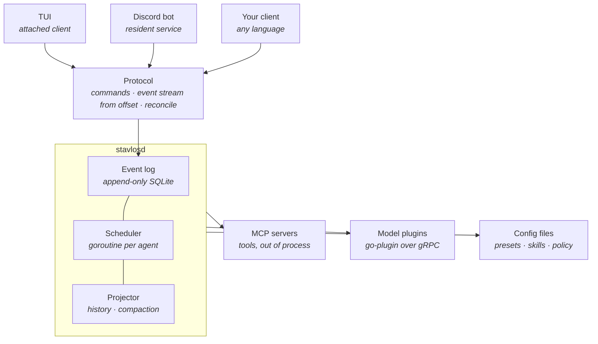
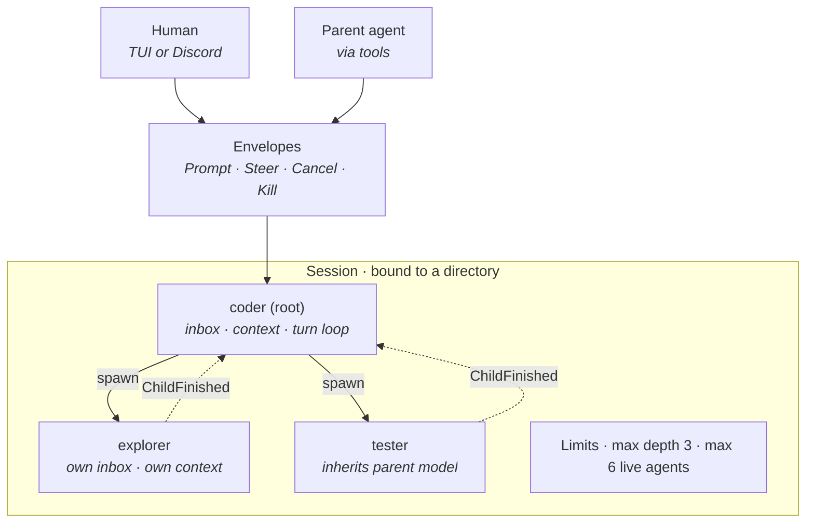
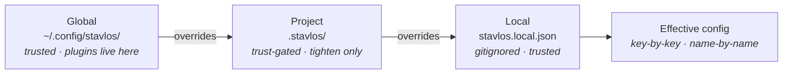
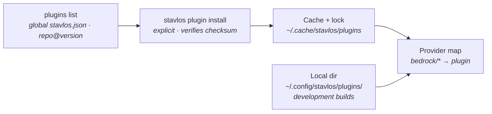

# Stavlos — Product Requirements Document

**Status:** Draft v0.4
**Scope:** v1
**Last updated:** 2026-09-12

---

## 1. Overview

Stavlos is an open-source agent harness written in Go. It runs a tree of AI coding agents on your machine and lets you drive them from a terminal UI, from Discord, or from any client that speaks its protocol.

The name is Greek for *stable* — the building where you keep workhorses. Stavlos houses a set of agents, dispatches them to work, and takes them back in when they're done.

The thesis in one sentence: **an agent is a long-lived actor you can talk to, not a function you call.** Every design decision below follows from taking that seriously — subagents that can be steered and cancelled mid-flight, frontends that are peers of one another, and a daemon that outlives all of them.

### Non-goals for v1

- Hosted or multi-tenant operation. Stavlos is local-first.
- IDE extensions.
- A web UI. The protocol permits one; we don't ship one.
- Sandboxing enforced by the daemon (see §12).
- Project-level plugins. Plugins are global (see §11).
- Autonomous unattended operation without an explicit permission policy.

---

## 2. Why this exists

**Delegation is fire-and-forget-and-wait.** Existing harnesses dispatch a subagent, block, and receive a blob of text. You cannot add an instruction to a running subagent without interrupting it, cannot cancel one turn without killing the session, and cannot tell "the turn ended" apart from "the work is done."

**Remote access is a bolt-on.** Every Discord bridge in the wild wraps a CLI or REST client around a TUI-first product. The remote surface is permanently second-class: sessions it can't see, prompts it can't answer, state it can't reconcile after a disconnect.

**The interesting seams aren't reachable.** Customization is usually a plugin API on top of a fixed core. The agent loop and the model adapter — the parts worth replacing — are welded in.

---

## 3. Design principles

1. **Subagents are first-class actors.** They can be prompted, steered, cancelled, and killed by the orchestrating agent or by a human, through the same inbox. They signal completion explicitly, with a typed payload.
2. **Frontends are peers.** The TUI and the Discord bot are both clients of the same daemon. Neither is privileged. Whatever the protocol can't express, no frontend can do.
3. **The log is the truth.** Every state change is an event. Everything a client or a model sees is a projection of the log. Resume, fork, replay, catch-up, and compaction are consequences of this, not features.
4. **Every capability is replaceable, on a schedule.** Model, loop, tools, storage, and frontends are all swappable. Defaults ship; nothing is welded in. But interfaces freeze only when they've earned it.
5. **A cloned repo cannot run code on your machine.** Project configuration is data. Anything executable is installed explicitly, globally, and verified.

---

## 4. Architecture

### 4.1 Process model



`stavlosd` is the only thing that owns state. Clients attach, subscribe, issue commands, and detach. The daemon survives every client. Everything below the daemon is either a subprocess it supervises or a file it reads.

### 4.2 The core (not replaceable)

Three contracts define Stavlos. Everything else plugs into them.

**Event log.** Append-only, SQLite-backed. Every state change is an event. Each event carries two numbers: a **per-session sequence**, contiguous within its session and the unit of offset subscription and fork, and a **global sequence** that totally orders events across sessions. No *session* state is stored outside the log that could disagree with it. Daemon-level state that is not session state — trust decisions, the plugin lockfile, the Discord allowlist, channel-to-session bindings — lives in the daemon's data directory.

**Scheduler / actor model.** One goroutine per live agent. Each agent owns a typed inbox and a `context.Context` derived from its parent's, so cancellation propagates down the tree for free.

**Protocol.** The wire contract between daemon and clients. This is the most consequential artifact in the project (§9).

### 4.3 Projection

The event log stores what happened. The **projector** turns it into what a model sees. Model-visible conversation history is never stored separately — it is computed from the log on demand and cached.

Two things the projector must handle, both of which are v1 requirements:

**Truncated turns.** A cancelled turn can leave a partial assistant message and a `tool_use` with no matching `tool_result`. Provider APIs reject that shape. The projector synthesizes a `tool_result` marking the call as cancelled (and, if the tool had produced partial output, including it). The model sees an honest account of what happened and can continue coherently.

A daemon crash or restart produces the same shape. On startup the daemon appends a `TurnAborted` event for every turn that was open when it stopped, and the projector repairs it exactly as a cancelled turn. Agents come back idle with their queued inboxes preserved. Nothing restarts automatically.

**Compaction.** Long sessions exceed context windows. When the projected history approaches the model's limit, the daemon summarizes older turns via the model and truncates oversized tool outputs, then appends a `Compacted` event carrying the summary and the sequence range it replaces. The log is untouched; only the projection changes. Clients render the boundary. Compaction runs automatically and can be triggered manually.

### 4.4 Accounting

Every model call appends a `Usage` event: input, output, and cached tokens, the model ID, and the cost computed from models.dev pricing. Usage is aggregated per agent and per session, exposed by the `status` tool and the protocol, and rendered by frontends. Caps are post-v1 (§14); accounting is v1 because caps are meaningless without it and an orchestrator choosing models per task needs to see what its choices cost.

### 4.5 Replaceable seams

| Seam | Mechanism | v1 stability |
|---|---|---|
| Frontends | Protocol clients (any language) | Stable |
| Tools | MCP servers | Stable |
| Model adapters | `go-plugin` (gRPC) | Provisional |
| Agent loop | Go interface, `go-plugin` later | Unstable |
| Store | Go interface, `go-plugin` later | Unstable |
| Skills | `SKILL.md` files | Stable |
| Agent presets | YAML + markdown | Stable |
| Policy | Declarative config | Stable |

Staged stability is deliberate. Committing to six frozen interfaces in v1 produces a v1 we can't iterate on.

---

## 5. Sessions

A **session** is a root agent plus the subtree it spawns, bound to a working directory. Sessions are the unit of independence: two sessions bound to the same directory share nothing but the filesystem. Starting the CLI in a directory starts a session; starting it again in the same directory starts another.

Each session owns:

- its own event history (a contiguous range in the log, keyed by session ID)
- its own agent tree
- its own live-agent budget (§6.5)
- its own model selection, which children inherit by default (§8.3)

Sessions survive client disconnects and daemon restarts (§4.3). They can be listed, resumed, forked from any per-session sequence offset, and archived.

---

## 6. Agents



Humans and orchestrating agents write the same envelope kinds into the same inboxes. Spawning is asynchronous: `spawn` returns immediately, and the child's `agent_finish` comes back as a `ChildFinished` envelope. Two sessions on the same directory would be two of these boxes side by side, each with its own budget and its own Discord channel.

### 6.1 The actor

Every agent — root or subagent — is a goroutine with a typed inbox:

```go
type Envelope interface{ isEnvelope() }

type Prompt        struct{ Text string }                 // queued; runs after the current turn
type Steer         struct{ Text string }                 // preempts at the next model-call boundary
type Cancel        struct{}                              // ends the current turn; agent survives
type Kill          struct{}                              // tears down the agent and its subtree
type ChildFinished struct{ ID AgentID; Result Result }   // a child called finish
type Reply         struct{ RequestID string; Answer any } // answer to a permission or question request
```

The orchestrating agent (via tools) and humans (via TUI or Discord) write to the same inbox. Nothing about "interactable by agent or user" needs special casing.

### 6.2 Turn semantics

A **turn** is one run of the agent loop: model call, tool calls, model call, … until the model stops calling tools. The four control envelopes differ in *when* they take effect:

| Envelope | Takes effect | In-flight tool call | Turn history |
|---|---|---|---|
| `Prompt` | After the current turn ends | Runs to completion | Intact |
| `Steer` | At the next model-call boundary | Runs to completion; output logged | Intact up to the boundary; steer text is injected before the next model call |
| `Cancel` | Immediately | Interrupted: the tool's context is cancelled; partial output logged | Truncated; projector synthesizes a cancelled `tool_result` |
| `Kill` | Immediately | Context cancelled | Agent and subtree torn down; log preserved |

Separating `Prompt` from `Steer` is the whole point. Other harnesses only offer the interrupting variant, so "also check X when you're done" derails work in flight. Steer is deliberately *not* a hard interrupt: a running `bash` command finishes and its output is recorded before the model is redirected. This keeps the log coherent and the semantics simple.

`Cancel` cancels the *turn's* context, not the agent's. Tool calls derive their context from the turn, so an in-flight command is interrupted. Children derive their context from the parent *agent*, not the parent's turn, so cancelling a parent's turn leaves its children running. The loop returns to waiting on its inbox.

Edge semantics, which protocol clients depend on:

- **Steer to an idle agent** behaves as a `Prompt`: it starts a turn and is logged as a prompt. Steer is "Prompt, but preempting if busy", and it is what the TUI sends for plain text.
- **Multiple queued `Prompt`s** are coalesced: when the turn ends, the inbox is drained and every queued prompt is delivered as a separate user message in one next turn.
- **`Cancel` with a pending permission or question prompt** withdraws it. The daemon emits a withdrawal event, every client removes the prompt, and a late `Reply` is rejected with an explanation (§7.4).
- **`ChildFinished` to a busy parent** waits in the inbox and is delivered with the next turn's input.

### 6.3 Completion

Subagents get an `agent_finish` tool:

```go
finish(summary string, artifacts []Artifact, status Status)
```

A turn ending and work being done are different events. A subagent may run six turns before declaring completion, and the parent receives a typed payload rather than "whatever the last message said."

The root agent does not get `agent_finish`. It has no parent to report to; the session simply idles between turns. `agent_finish` is added to the tool list only for spawned children.

**Spawning is asynchronous, children never interrupt, and there is no blocking wait.** `spawn` returns immediately with the child's ID. When the child calls `agent_finish`, its result lands in the parent's **mailbox**; that delivery is built in and cannot be switched off. The finish also **wakes** the parent: the first child to finish starts a new turn carrying every result that has arrived, so several finishing together wake the parent once. `agent_status` and `agent_result` let a parent check in early. An opt-out (`unmonitor`) existed briefly and was removed along with the explicit `monitor` wait; a wake the parent cannot lose is the whole point. Arming is logged (`monitor.armed` / `monitor.disarmed`) so it survives a daemon restart. Nothing is ever injected into a running turn: a child finishing mid-turn waits for the boundary. A blocking wait was considered and rejected: it makes the parent deaf for the duration and buys nothing, since the history is intact when the result arrives.

### 6.4 Orchestration tools

Available to any agent whose preset permits them:

| Tool | Effect |
|---|---|
| `agent_create(archetype, label, task, model?)` | Create a child agent; returns its ID immediately |
| `agent_prompt(id, text)` | Queue a `Prompt` for any agent in the session |
| `agent_steer(id, text)` | Deliver a `Steer` to any agent in the session (main agent only) |
| `agent_cancel(id)` | Deliver a `Cancel` |
| `agent_kill(id)` | Deliver a `Kill` |

There is no wait tool. A parent that has nothing to do until a child reports simply ends its turn; the child's `agent_finish` wakes it. Models were unreliable with an explicit "wait" tool (calling it at odd moments), and the turn ending naturally is the same thing.

**Background jobs** use the same mailbox and wake: `bash_async(command)` starts a job and returns its id at once; when it exits the agent is woken with the exit code and output, and `bash_async_kill(id)` stops it. Every agent with `bash` has these. Nothing is armed by hand: a job's exit always wakes its owner, as a child's finish always wakes its parent. Jobs are logged (`monitor.started`, `monitor.fired`, `monitor.stopped`); a job whose process died with the daemon is reported to its owner as lost on restart. File watches and timers were tried and removed: models rarely used them well, and `bash_async` of `sleep` or `inotifywait` covers the need. In the TUI, the permission queue, live children ("agents") and jobs ("async") are three permanent tabs on one strip under the rule that closes the chat, each showing only its count (down to "(0)") until opened; the strip is one stop in the tab cycle (it opens on the first non-empty tab, permission when all are empty) and ←/→ move between tabs.
| `agent_result(id)` | Retrieve a finished result without blocking |
| `agent_status(id?)` | State and usage (§4.4) of one agent, or the whole session tree |

**Prompting is session-wide, steering is the main agent's, lifecycle is parent-only.** Every agent has `agent_prompt` and `agent_status`: a prompt may address any agent in the same session — a child, a sibling, or the caller's parent — and the recipient sees who sent it (`from` on the logged message, `[message from agent …]` in the model's history). `agent_steer` is offered only to the main agent, since a steer cuts into a running turn; subagents that need to redirect someone prompt them instead. `agent_cancel`, `agent_kill` and `agent_result` still work only on the caller's own children: killing an agent someone else created would fire its parent's wake with a surprise. "Same tree" means same session; agents never reach across sessions.

`label` is **required** on spawn. It is the human-facing name in thread titles, pickers, and webhook identities. Optional labels produce unusable UI.

`model` is optional. When given, it overrides the child's preset default (§8.3). This lets an orchestrator make its own cost/capability decisions — "use a light model for the easy tasks, a heavy one for the hard tasks" — from instructions in `AGENTS.md` or its preset.

### 6.5 Limits

Two independent guards. Both are enforced primarily by removing `spawn` from the tool list at the next model call, so the model is never invited to do something it can't. The tool list is fixed for the duration of a model call, so a `spawn` that races the cap within a turn returns an error naming the limit; that is the fallback, not the mechanism.

- **Depth.** Configurable, default 3. Harnesses without this guard have produced documented cases of 18 levels of agents re-dispatching to each other with only the deepest doing real work.
- **Fan-out.** A per-session cap on live agents, default 6. Every session gets its own budget: six agents with two sessions running means twelve live agents on the machine. There is no global cap in v1.

Depth alone does not bound cost. Fan-out alone does not bound recursion. Both are required.

---

## 7. Frontends

### 7.1 Two kinds of client

- **Attached clients** connect, render, and exit. Many may be attached at once. The TUI is one.
- **Resident services** are supervised by the daemon and outlive every session they serve. The Discord bot is one.

Conflating these gets one of their lifecycles wrong.

### 7.2 TUI (Bubble Tea)

The TUI is the reference implementation of the protocol. Dogfooding it is the forcing function that keeps the protocol good enough for third parties.

Requirements:

- Session list; create, resume, fork
- Agent tree navigation (parent / child / sibling)
- Live turn output with tool-call rendering, including cancelled calls and compaction boundaries
- Direct addressing of any agent in the tree with any envelope kind
- Permission and question prompts
- Model and preset switching mid-session: `/models` picks a model, `/role` switches the selected agent's preset in place (system prompt, tools, spawn list change at its next turn; logged as `agent.role_changed` and replayed on restart); `/yolo` flips a session-wide switch (logged as `session.yolo_changed`, replayed on restart) under which every tool call a policy would ask about is allowed without a prompt and waiting prompts are approved on the spot — explicit deny rules, model questions and the project-trust prompt are unaffected, and the TUI shows a YOLO tag before the role while it is on; it is per session rather than per agent (no guessing which subagents have it) and never daemon-wide (other sessions are untouched); `/variants` picks a model variant — a provider-defined flavour such as reasoning effort (ChatGPT: low/medium/high/xhigh, Grok mini models: low/high) — per agent, logged as `agent.variant_changed`, inherited by a child that inherits its parent's model, and shown after the model on the meta row; `/provider` connects a provider (§8.4)

Implementation note: Bubble Tea's update loop is single-threaded. Daemon events arrive via `p.Send()` from a goroutine reading the event stream. Keep that boundary clean — TUIs that call business logic from `Update` become untestable.

### 7.3 Discord

**Structure.** Guild = workspace. **Channel = session.** Thread = subagent. The session's root agent lives in the channel; each spawned subagent gets a thread. A session is bound to a directory, so two channels can drive two independent sessions on the same directory. `/session new <dir>` creates a channel and binds it; `/session attach <id>` binds a channel to an existing session.

**Outbound identity.** Webhooks, which allow per-message username and avatar. Each agent posts under its own label.

**Inbound addressing.** Mentionable roles, one per *archetype* (`@coder`, `@explorer`, `@tester`). Roles need no members to be mentionable. Discord resolves them client-side and delivers `mention_roles` in the message payload, so there is no text parsing.

**Verbs.** A plain message is a `Steer`: it reaches a busy agent at its next model-call boundary and simply starts a turn when the agent is idle, which is what people mean when they type at a working agent. `/queue <text>` sends a `Prompt` instead (after the current turn), and esc twice on an empty input (the first press warns, the second within a few seconds confirms) sends a `Cancel`. Creating and killing agents is left to the model (`agent_create`, `agent_kill`); humans steer, they do not micromanage the tree. Role mentions and thread context choose the *target*; the slash command chooses the *verb*. A slash command with no target in a channel addresses the root; in a thread it addresses that thread's agent.

**Scoping.** Roles are guild-scoped; there is no channel-scoped role. Resolution is therefore on the pair `(channelID, roleID)` — `@coder` in one channel and `@coder` in another reach different agents via the same role. Inside a subagent thread, a plain message with no mention targets that thread's agent; role mentions still work there for addressing siblings or the root. Disambiguation (below) is therefore only needed for mentions in the channel itself.

**Disambiguation.** When an archetype has multiple live instances in a session, reply with an ephemeral select menu. Option label is the instance's task label; description is `under {parent archetype}: {parent label}` plus live status. Include an "all instances" broadcast option. The user's message text must survive the interaction round trip — store it server-side keyed by a nonce in the `custom_id`, with expiry.

**Constraints to design around:**

- ~250 roles per guild; role creation is rate-limited → archetype roles created once at `/setup`, never per-spawn
- 500 channels per guild, 1000 active threads per guild, and threads auto-archive after at most 7 days → a finished subagent's thread archiving is fine; a guild that runs many sessions needs channels cleaned up (see Archiving)
- String select max 25 options; description max 100 chars
- The bot's role must sit above roles it manages — check on startup and fail loudly
- Set `allowed_mentions` explicitly on every outbound message, or agent chatter will ping humans
- Message Content is a privileged intent; document it in setup

**Archiving.** Archiving a session unbinds its channel and renames it with an `archived-` prefix. The channel and its history are kept; deleting it is the user's call. The event log remains the truth regardless.

**Access control.** Allowlist by user and role. The initial allowlist is configurable only via CLI, never from Discord, to prevent bootstrap attacks.

### 7.4 Escalation

Permission and question prompts need a routing policy, since several clients may be attached and none may be watching. Every client declares an **escalation tier** when it attaches: `interactive` or `fallback`. The TUI attaches as `interactive`; the Discord service attaches as `fallback`. Nothing in the daemon knows about Discord specifically.

1. The prompt is broadcast to all `interactive` clients. A client **claims** it when a human starts answering (focuses or opens the prompt), by sending an explicit claim; delivery alone never claims, so an unattended client cannot absorb prompts. The claimant is the only one that can answer. A claim with no `Reply` expires after a short timeout and the prompt is re-broadcast.
2. If unclaimed after *N* seconds, it is broadcast to `fallback` clients as well.
3. If unanswered after *M* seconds, the configured headless default applies (default: deny).

*N* and *M* are single global settings in v1. Once a default has been applied, or the prompt has been withdrawn by a `Cancel` (§6.2), late answers are rejected with an explanation rather than silently ignored.

A subagent blocked forever on an approval nobody will see is the most common failure in this category of tool. The headless default must be explicit config, not emergent behavior.

---

## 8. Models

### 8.1 Approach

Other harnesses load provider adapters dynamically from npm. Go has no runtime module loader, so that doesn't port.

Instead: **consume the metadata, implement the protocols.** `models.dev/api.json` is a language-agnostic community database of model specs, pricing, capabilities, and auth env vars. Stavlos fetches and caches it for metadata; wire protocols are implemented natively.

### 8.2 Shipped adapters

Stavlos serves two providers, both through the user's own subscription rather than platform API keys:

| Provider | Sign-in | Wire protocol |
|---|---|---|
| `openai` (ChatGPT Plus/Pro) | Codex sign-in at `auth.openai.com`: browser (PKCE, callback on `localhost:1455`) by default, or headless device code (needs "Device code authorization for Codex" enabled in ChatGPT's Security settings) | OpenAI Responses API at the Codex backend (`chatgpt.com/backend-api/codex/responses`), bearer token plus account-id header |
| `xai` (SuperGrok) | Grok CLI device-code login at `auth.x.ai` (RFC 8628) | Chat Completions at `api.x.ai/v1` with a bearer token |

Both use the official CLIs' public client ids, the same arrangement opencode uses. An OpenAI-compatible Chat Completions adapter and an Anthropic Messages adapter exist in-tree for future providers and plugins but are not offered in the picker. `Model` is an interface; exotic providers arrive as `go-plugin` binaries (§11).

### 8.3 Resolution

Model IDs are `provider/model-id`. When an agent starts, its model is resolved in this order, first match wins:

1. The `model` argument to `spawn`, if the parent supplied one
2. The `model` field in the agent's preset, if set
3. The parent's active model (for the root agent: the session's selected model)
4. Global config

Example: global config says `anthropic/claude-sonnet-5`; the user switches the session to `anthropic/claude-opus-5`; the root spawns a `tester` whose preset says `openai/gpt-5-mini`. The tester runs on `gpt-5-mini`. If the preset had no `model` field, it would run on `opus` — the parent's active model, not the global default. A child that inherits the global default while its parent is running something else is a real bug in existing harnesses; cover it in tests.

Resolution happens **once, at spawn**. Switching a session's or a parent's model afterwards does not touch running children; to change a child's model, address the child directly with the model-switch command (§9). Live-linking would make a child's behaviour change under it mid-task with no event in its own history to explain why.

The `provider` prefix is looked up in the provider map (§11.4). An unknown prefix fails at session start with the command needed to install the missing plugin.

### 8.4 Credentials

Credentials are subscription logins, stored in `<data dir>/auth.json` (mode 0600) as `{"openai": {"type": "oauth", "access": …, "refresh": …, "expires": …, "account_id": …, "email": …}}`. The TUI's `/provider` (and `stavlos auth login`) offers ChatGPT and Grok. ChatGPT then asks for a login method, as opencode does: **browser** (default; the daemon listens on `localhost:1455`, opens the authorize URL with PKCE, and exchanges the code when OpenAI redirects back) or **headless** (a URL plus a short code to enter on any device; polled). Grok has only the device-code method. Access tokens are refreshed on demand, single-flight per provider, and the rotated pair is persisted. `/models` lists what each subscription serves (for ChatGPT, the models the Codex backend accepts) at zero per-token cost, since the subscription is the billing unit; token counts are still recorded.

A session always starts, model or no model: the TUI opens, and a turn with no model, or a signed-out provider, ends with an error naming `/models` and `/provider`. Spawning a child does require a resolvable model. The first model picked in a session with none becomes the global default. `stavlos auth list` and `stavlos auth logout` round it out. Environment variables and API keys are not consulted.

---

## 9. Protocol

The most important artifact in the project.

**Transport.** Newline-delimited JSON-RPC 2.0 over a Unix domain socket in the daemon's data directory. The event stream is a subscription: the client sends one request naming a session and a per-session offset, and receives events as server-to-client notifications until it unsubscribes or disconnects. The choice is deliberate: any language can speak it, `nc` can debug it, and no code generation is required. TCP is a roadmap item for multi-machine operation; the daemon binds only the socket in v1. Every request carries a protocol version, and the daemon rejects versions it does not serve with the range it does.

**Documentation.** The protocol specification is a v1 deliverable in its own right (§14): a message-by-message reference sufficient for a third party to write a client without reading the Go source.

It must carry:

- Session list, create, resume, fork, archive; directory binding
- Agent tree with parent links, labels, archetypes, and live status
- All control envelopes (`Prompt`, `Steer`, `Cancel`, `Kill`), addressed to any agent by ID
- `spawn` with preset, label, task, and optional model
- Permission and question requests, claim, withdrawal, **and their replies**; the client's escalation tier at attach (§7.4)
- Trust prompts for project configuration (§10.6) and their replies
- Model and preset switching for a session or agent
- Event stream subscribable **from a per-session sequence offset**, not live-tail only
- Compaction events, so clients can render boundaries
- Usage events and per-agent / per-session aggregates (§4.4)
- An authoritative state-reconciliation endpoint

The offset requirement is what lets a Discord bot that was offline for an hour catch up rather than showing a hole. Best-effort streaming without replay forces every client to reconcile by polling — a known failure in existing harnesses.

---

## 10. Configuration



Three layers with one layout. Global is yours and trusted. Project is the team's, committed, and untrusted until confirmed. Local is your per-project overrides, gitignored and trusted. Config keys merge key-by-key; presets and skills override name-by-name.

### 10.1 Layout

```
~/.config/stavlos/            # global; identical layout to .stavlos/ plus plugins
  stavlos.json
  agents/<name>.md
  skills/<name>/SKILL.md
  plugins/<name>/             # local plugin builds (§11)
  plugins.lock.json

<project>/
  .stavlos/
    stavlos.json              # committed
    stavlos.local.json        # gitignored
    agents/
      coder.md                # one preset per file; filename = archetype
      explorer.md
    skills/
      go-conventions/
        SKILL.md              # required; anything else in the dir is bundled, not discovered
        reference.md
        scripts/lint.sh
  AGENTS.md                   # project instructions; stays at the repo root
```

### 10.2 `stavlos.json`

JSONC with a `$schema` for editor validation. Every key is optional; anything omitted falls through to the next layer, then to built-in defaults. `stavlos.local.json` has the identical schema.

```jsonc
{
  "$schema": "https://stavlos.dev/schema/v1/stavlos.json",

  "model": "anthropic/claude-sonnet-5",   // default for root sessions here
  "rootAgent": "coder",                   // preset a new session's root uses

  "limits":     { "maxDepth": 3, "maxAgents": 6 },
  "escalation": { "claimTimeout": "30s", "answerTimeout": "3m", "default": "deny" },
  "compaction": { "threshold": 0.8, "maxToolOutput": "32kb" },

  // MCP servers reachable by presets that list them. Trust-gated at project level.
  "mcp": {
    "github": {
      "command": "npx",
      "args": ["-y", "@modelcontextprotocol/server-github"],
      "env": { "GITHUB_TOKEN": "${env:GITHUB_TOKEN}" }   // references only, never literals
    },
    "docs": { "url": "https://mcp.example.com/sse" }
  },

  // Keyed by tool, then by argument pattern. Most specific match wins.
  "policy": {
    "bash":  { "git push*": "ask", "rm -rf*": "deny", "*": "allow" },
    "apply_patch": { "src/**": "allow", "**": "ask" },   // every path a patch touches is checked; the strictest wins
    "read":  "allow",
    "agent_create": "allow",
    "skill": "allow",
    "mcp:github/*":     "ask",
    "mcp:github/get_*": "allow"
  },

  // Global config only. Ignored with a warning if present at project level.
  "plugins": ["github.com/acme/stavlos-bedrock@v1.2.0"]
}
```

### 10.3 Presets — `agents/<name>.md`

A preset defines an archetype. The filename is the archetype name and becomes the Discord role.

```markdown
---
description: Implements features and fixes bugs in this repo
model: anthropic/claude-sonnet-5      # optional; omitted → inherits parent's active model
loop: default                          # optional; only 'default' ships in v1
tools: [bash, read, apply_patch, finish]
skills: [go-conventions]               # skill descriptions this agent carries in context
mcp: [github]                          # servers from stavlos.json this agent may reach
spawn: [explorer, tester]              # archetypes it may spawn; omit → cannot spawn
policy:                                # preset-level tightening only
  bash:
    "git push*": deny
---

You are a Go engineer working in this repository. Prefer small commits.
Delegate reading unfamiliar code to an explorer before editing it.
```

The orchestration tools (`agent_*`) are implied by a non-empty `spawn` list. Presets are the hub — skills, MCP servers, and policy are referenced *by* presets, not parallel to them. Preset creation must be as frictionless as skill creation, or users will reach for skills when a preset is correct.

### 10.4 Skills — `skills/<name>/SKILL.md`

A skill is a directory containing a `SKILL.md` with frontmatter (`name`, `description`) plus a body, and optionally scripts, templates, and reference files alongside it. Discovery is "every directory under `skills/` containing a `SKILL.md`"; nothing else is scanned.

Descriptions stay in context; bodies load only when an agent calls the `skill` tool, which is gated by the `skill` permission. Skills are scoped **per archetype** via the preset's `skills:` list — otherwise every agent carries every description and progressive disclosure is defeated.

### 10.5 `AGENTS.md`

Plain markdown at the repo root, injected into every agent's context in that project. This is model-facing prose, not config: it is where "use light models for easy tasks" instructions live.

### 10.6 Trust

Project configuration is data, but a cloned repository's data can still cause code to run: `mcp` server definitions start processes, policy `allow` rules loosen what the model may execute, and presets, skills, and `AGENTS.md` are instructions the model will follow. On first load of a directory, the daemon prompts once for **all of it** — the whole `.stavlos/` directory plus `AGENTS.md` — showing what it contains, and records the decision keyed by directory plus a hash of those files' contents. A change to any of them re-prompts. Until confirmed, nothing from the project layer is loaded: no MCP servers start, no `allow` rules apply, no presets or skills are discovered, and `AGENTS.md` is not injected. The session runs on global configuration alone, and the TUI and Discord both show that the project layer is pending trust.

Project-level policy can only **tighten** global policy, never loosen it, even once trusted. `stavlos.local.json` is trusted and never prompts.

### 10.7 Deliberately not in `.stavlos/`

- Plugin binaries or plugin references — global only (§11)
- Credentials — `${env:NAME}` references only; provider credentials are environment variables in v1 (§8.4)
- The Discord allowlist — global, CLI-only
- Session state, logs, caches — the daemon's data directory, never the project

---

## 11. Plugins



### 11.1 What a plugin is

A `go-plugin` binary — subprocess plus gRPC, via `github.com/hashicorp/go-plugin`, not the Go stdlib `plugin` package. It requires no recompilation of the host, imposes no toolchain or dependency version matching, isolates crashes, and allows plugins in any language. gRPC overhead is negligible against LLM call latency.

Reserved for the deep seams: `Model` (v1), `Loop` and `Store` (post-v1). Everything else has a lighter mechanism — tools are MCP servers, observation is any protocol client subscribing to the event stream, and allow/ask/deny is policy.

### 11.2 Global only

Plugins are configured in `~/.config/stavlos/stavlos.json` and never in `.stavlos/`. A provider adapter is about *your* accounts and credentials, not the project's. A project says `"model": "bedrock/…"`; if no installed plugin serves `bedrock`, the daemon fails at session start with the install command. This also means the trust question never arises for plugins: nothing in a cloned repository can cause a binary to run.

### 11.3 Sources and installation

Two sources:

- **References** in the global `plugins` array, Go-module style: `host/owner/repo@version`. `stavlos plugin install` resolves the release asset for the current OS/arch, verifies its checksum, unpacks it into `~/.cache/stavlos/plugins/`, and writes `plugins.lock.json`.
- **Local directories** under `~/.config/stavlos/plugins/<name>/`, for development builds.

Installation is explicit, not automatic at daemon startup. For binaries, "the daemon downloaded and ran something because a config line changed" is the wrong default. Startup loads what the lock resolves plus the local directory, and warns on anything unresolved.

Every plugin ships a manifest:

```json
{
  "name": "bedrock",
  "version": "1.2.0",
  "kind": "model",
  "apiVersion": 1,
  "providers": ["bedrock"],
  "binaries": { "darwin/arm64": "stavlos-bedrock", "linux/amd64": "stavlos-bedrock" }
}
```

`kind` and `apiVersion` gate the go-plugin handshake, so a plugin built against a future API fails loudly today.

### 11.4 Registration and load order

`providers` is how registration works: the daemon builds a map from provider prefix to plugin, and model IDs route through it. Two plugins claiming the same provider is a startup error, not last-wins.

Load order is the `plugins` array first, then the local directory. A local build therefore shadows a released one of the same name — the one place shadowing is what you want during development — and the daemon logs it.

---

## 12. Execution environment

Agents run commands directly against the session's working directory. The daemon does not create worktrees or containers and does not enforce isolation.

This is a scope decision, not an oversight. Isolation strategies vary — git worktrees, containers, VMs, nothing — and the right one depends on the project. Stavlos leaves it to the user and the model: a preset or skill can instruct an agent to create a worktree before touching files, and policy can deny writes outside a given path. Daemon-enforced sandboxing is on the roadmap and will be designed so that policy remains unchanged when it lands; the policy schema is therefore safe to mark stable now.

---

## 13. Policy

Declarative config in v1: per-tool and per-pattern `allow | ask | deny`, evaluated against agent, tool, and arguments. Defined in `stavlos.json` (§10.2) and tightened per preset (§10.3). Project-level rules are subject to the trust gate (§10.6).

**Matching.** Patterns are globs matched against the tool's full argument string: the command line for `bash`, the path for `read`, `write`, and `edit`, the tool name for `mcp:*`. When several patterns match, the one with the **longest literal prefix** before its first wildcard wins; ties fall to the more restrictive verb (`deny` > `ask` > `allow`). Rules from different layers are merged into one set before matching, then the tighten-only rule of §10.6 applies. This is string matching, not a sandbox: `rm -rf*` does not match `rm -r -f` or `cd x && rm -rf`. It is a guard against the model's ordinary behaviour, not an adversary's, and the doc says so wherever policy is described to users.

A scripted policy (Starlark) is **deliberately post-v1**. Most users want "deny edits outside the project, ask before pushing," which declarative config handles. Shipping a language means shipping its docs, error reporting, and debugging story. The internal policy interface will be shaped so a scripted implementation can slot in later.

There is also no hook for *rewriting* a tool call before it executes (escaping a shell argument, injecting an environment variable). Policy can block; nothing can modify. That capability belongs in a custom loop rather than a new seam — see open question 2.

---

## 14. v1 scope

**In:**

- `stavlosd` with event log, scheduler, agent tree, projector (cancelled-turn repair, compaction)
- Protocol (server + Go client) and the protocol specification document
- Bubble Tea TUI
- Discord service
- Codex (ChatGPT) and Grok adapters, `go-plugin` model seam, `stavlos plugin install`, lockfile, models.dev metadata
- MCP client
- Three-layer configuration with trust gate; skills, presets, declarative policy
- Built-in tools: `bash` (also the search tool: read-only commands such as `grep`, `rg`, `find`, `ls`, and `git status`/`log`/`diff` are allowed by default), `bash_async` and `bash_async_kill` (background jobs), `read`, `apply_patch` (the Codex patch grammar: add, update with context-anchored hunks, delete, move; several files per patch, applied atomically), `agent_finish`, `skill`, and the orchestration set (`agent_create`, `agent_prompt`, `agent_steer`, `agent_cancel`, `agent_kill`, `agent_result`, `agent_status`)
- Usage accounting: per-call `Usage` events, per-agent and per-session aggregates
- Subscription sign-in for ChatGPT and Grok (device-code flows, token refresh), credential store, `/provider` and `/models` in the TUI, `stavlos auth login|list|logout`
- Depth and per-session fan-out limits
- Escalation policy with headless default

**Out (roadmap):**

- `go-plugin` for `Loop` and `Store`
- Project-level plugins
- Starlark policy
- Pre-execution tool-call rewriting hooks
- WASM tools
- Web UI
- Daemon-enforced sandboxing
- Global (cross-session) agent and cost caps
- Per-project credential scoping; OAuth-style provider logins
- Multi-machine daemons (TCP transport for the protocol)

---

## 15. Open questions

1. **Grandchild addressing.** Should a human be able to `@explorer` past its parent coder, or should mentions reach only depth 1 with threads for anything deeper? Current lean: allow it, but notify the parent on `cancel` / `kill` so it doesn't discover a dead child with no explanation.
2. **Loop interface shape.** How much does a custom loop need access to? Too narrow and it isn't worth replacing; too wide and the contract can never stabilize. Pre-execution tool-call interception is the first concrete demand on this interface.
3. **Compaction policy.** Fixed threshold vs. per-model; whether subagent summaries are compacted into the parent independently of the parent's own history.

---

## 16. Success criteria

v1 is done when:

- A user can spawn three parallel coders from the TUI, walk away, and steer one from Discord on a phone
- A subagent blocked on a permission prompt escalates to Discord and can be answered there
- A subagent cancelled mid-tool-call from Discord can be resumed from the TUI and continues with coherent context
- Killing a subtree from either frontend leaves consistent state in both
- Two sessions on the same directory run concurrently without interfering
- A session that has been compacted resumes correctly after a daemon restart
- A daemon killed while an agent is mid-tool-call restarts with every agent idle and every history coherent
- A permission prompt raised while an unattended TUI is attached still reaches Discord
- Cloning a repository with a hostile `.stavlos/` starts no process and loosens no permission until the user confirms
- A third party can write a working client in a language that isn't Go, using only the protocol docs
- Adding a model provider requires no changes to Stavlos itself
